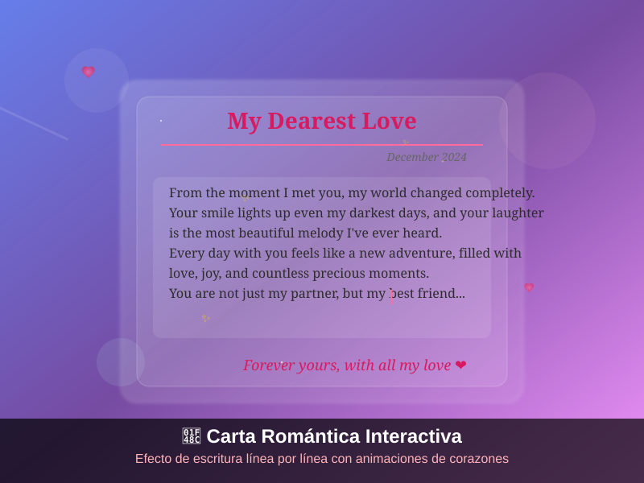

# 💌 Carta Romántica Interactiva

Una hermosa página web que simula una carta romántica escribiéndose línea por línea con efectos de animación, corazones flotantes y una sorpresa especial al final.

## ✨ Características

- **Efecto de escritura realista**: Cada línea se escribe con un efecto de máquina de escribir auténtico
- **Animaciones de corazones**: Corazones flotantes animados en el fondo
- **Sorpresa oculta**: Mensaje especial y foto romántica que aparece al final
- **Efectos interactivos**: 
  - Destellos al pasar el mouse sobre la carta
  - Corazones flotantes adicionales durante la animación
  - Efectos de hover y click en elementos
- **Diseño responsivo**: Se adapta perfectamente a dispositivos móviles y desktop
- **Estilo elegante**: Gradientes modernos, efectos de cristal y tipografía serif

## 🚀 Demo en Vivo

[Ver Demo](https://roimerbautista.github.io/Carta-interactiva-con-efecto)

## 📱 Vista Previa

### Carta Romántica en Acción


*La carta se escribe línea por línea con efectos de corazones flotantes y un hermoso fondo animado*

## 🛠️ Tecnologías Utilizadas

- **HTML5**: Estructura semántica
- **CSS3**: 
  - Animaciones y transiciones
  - Flexbox y Grid
  - Efectos de cristal (backdrop-filter)
  - Gradientes y sombras
- **JavaScript ES6+**:
  - Async/await para animaciones secuenciales
  - Manipulación del DOM
  - Efectos interactivos

## 📦 Instalación

1. **Clona el repositorio**:
   ```bash
   git clone https://github.com/tu-usuario/cartainteractivaconefecto.git
   cd cartainteractivaconefecto
   ```

2. **Abre el proyecto**:
   - Simplemente abre `index.html` en tu navegador
   - O usa un servidor local:
   ```bash
   # Con Python
   python -m http.server 8000
   
   # Con Node.js (si tienes live-server instalado)
   npx live-server
   
   # Con PHP
   php -S localhost:8000
   ```

3. **Visita**: `http://localhost:8000`

## 🌐 Despliegue

### GitHub Pages

1. **Sube tu código a GitHub**:
   ```bash
   git add .
   git commit -m "Initial commit"
   git push origin main
   ```

2. **Habilita GitHub Pages**:
   - Ve a Settings → Pages
   - Selecciona "Deploy from a branch"
   - Elige "main" branch
   - Guarda los cambios

3. **Tu sitio estará disponible en**:
   `https://tu-usuario.github.io/cartainteractivaconefecto`

### Vercel

1. **Instala Vercel CLI**:
   ```bash
   npm i -g vercel
   ```

2. **Despliega**:
   ```bash
   vercel
   ```

### Netlify

1. **Arrastra y suelta** la carpeta del proyecto en [netlify.com](https://netlify.com)
2. **O conecta tu repositorio de GitHub** para despliegue automático

## 🎨 Personalización

### Cambiar el contenido de la carta

Edita el array `letterLines` en `script.js`:

```javascript
const letterLines = [
    "Tu mensaje personalizado aquí...",
    "Segunda línea de tu carta...",
    // Añade más líneas según necesites
];
```

### Modificar colores

Cambia las variables de color en `styles.css`:

```css
:root {
    --primary-color: #ff6b9d;
    --secondary-color: #d81b60;
    --background-gradient: linear-gradient(135deg, #667eea 0%, #764ba2 100%);
}
```

### Ajustar velocidad de escritura

Modifica el parámetro `speed` en las llamadas a `typeText()`:

```javascript
await typeText(lineElement, letterLines[i], 80); // 80ms entre caracteres
```

## 📁 Estructura del Proyecto

```
cartainteractivaconefecto/
├── index.html          # Estructura principal
├── styles.css          # Estilos y animaciones
├── script.js           # Lógica de animación
├── README.md           # Documentación
└── screenshots/        # Capturas de pantalla (opcional)
```

## 🤝 Contribuciones

¡Las contribuciones son bienvenidas! Si tienes ideas para mejorar el proyecto:

1. Fork el repositorio
2. Crea una rama para tu feature (`git checkout -b feature/nueva-caracteristica`)
3. Commit tus cambios (`git commit -m 'Añadir nueva característica'`)
4. Push a la rama (`git push origin feature/nueva-caracteristica`)
5. Abre un Pull Request

## 📝 Licencia

Este proyecto está bajo la Licencia MIT. Ver el archivo [LICENSE](LICENSE) para más detalles.

## 💖 Créditos

Creado con amor para momentos especiales. Perfecto para:
- Aniversarios
- San Valentín
- Declaraciones de amor
- Sorpresas románticas
- Regalos digitales únicos

---

⭐ Si te gusta este proyecto, ¡dale una estrella en GitHub!

💌 ¿Usaste este proyecto para algo especial? ¡Me encantaría saberlo!